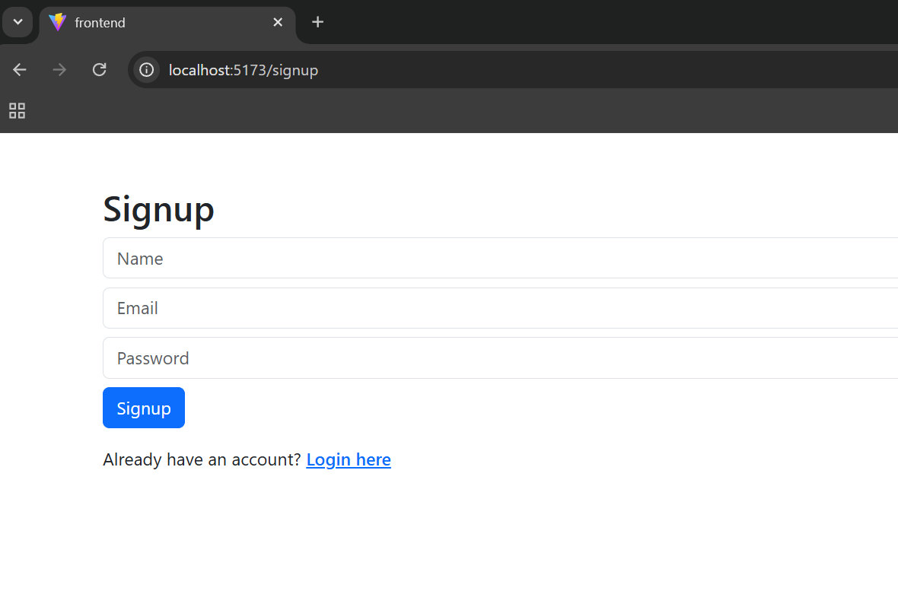
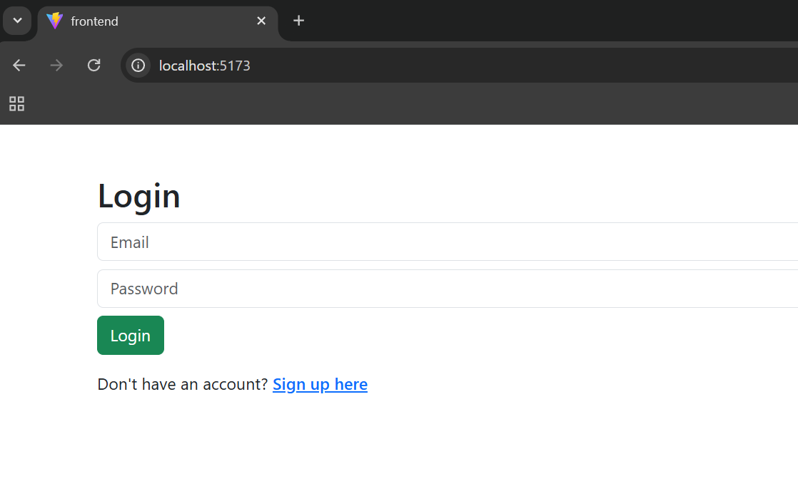
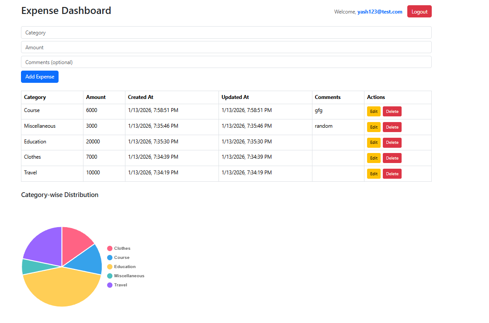
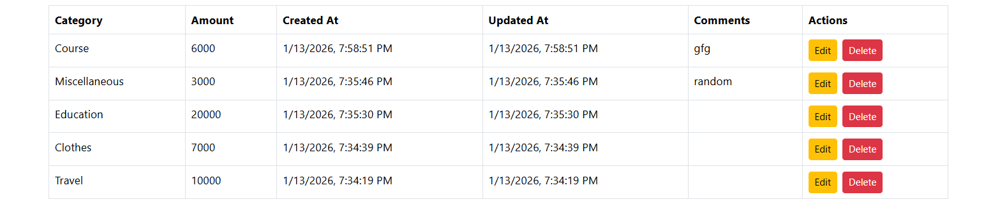

# 💰 Full Stack Expense Tracker

A full-stack expense tracker application that allows users to securely manage their expenses with authentication and category-wise analytics.

---

## 🚀 Features

- User Signup & Login (JWT Authentication)
- Add new expenses
- View expenses in a table (latest first)
- Edit and delete expenses
- Category-wise expense distribution using Pie Chart

---

## 🛠 Tech Stack

**Frontend:** React, Bootstrap, Chart.js  
**Backend:** Node.js, Express  
**Database:** SQLite  
**Authentication:** JWT  

---

## 📸 Screenshots

### 🔐 Signup Page


### 🔐 Login Page


### 📊 Dashboard


### 📄 Expense Table


### 📈 Category-wise Expense Chart


---

## ⚙️ Installation & Setup

### 1. Clone repository
```bash
git clone <your-repo-url>
cd ExpenseTracker
